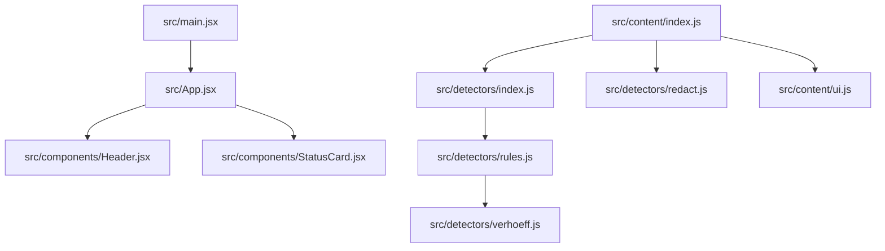
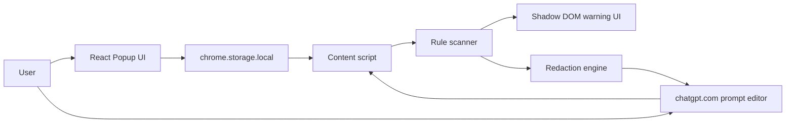
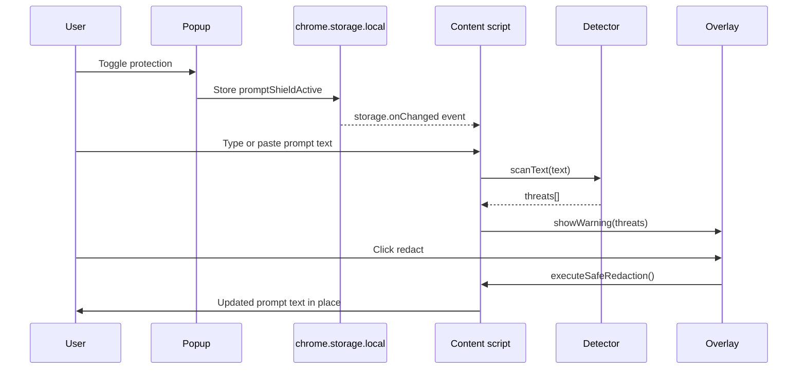
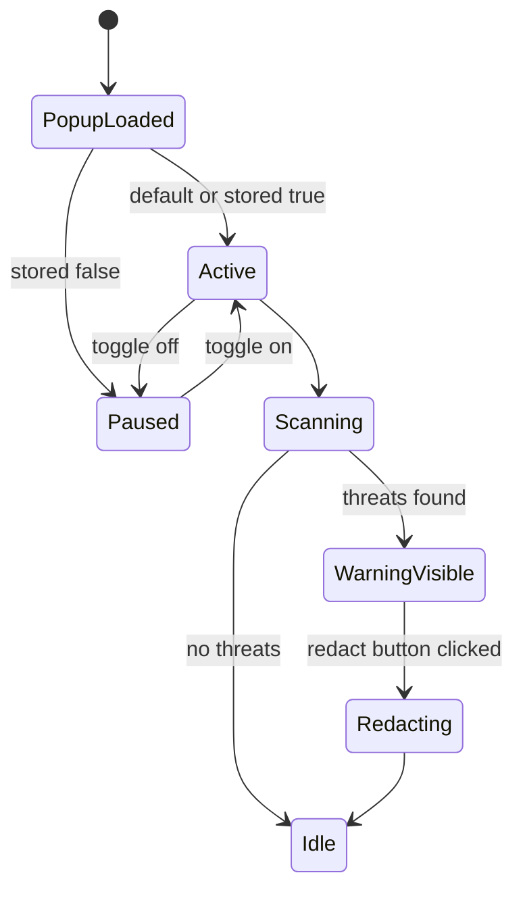
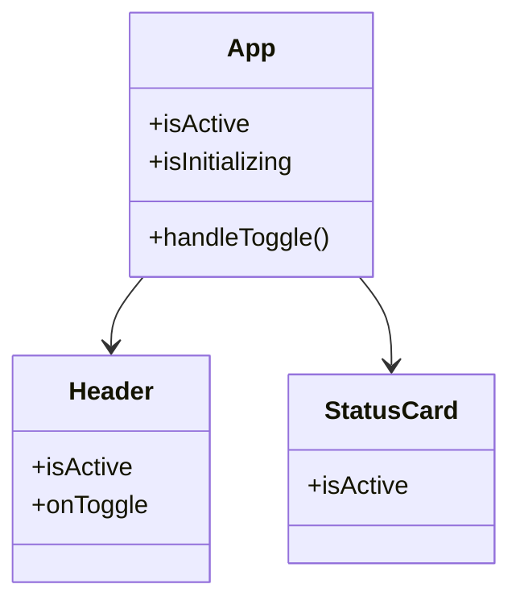

# PromptShield Documentation

## 1. System Overview

PromptShield is a small browser-extension-style application with two authored runtime surfaces:

- A React popup dashboard rendered from `index.html` and `src/main.jsx`.
- A content script injected into `chatgpt.com` that watches prompt input, scans text for sensitive data, and optionally redacts matches.

There is no backend server, database, queue, or authentication provider in the repository. All state is local to the browser.

The codebase is intentionally small and split into three main areas:

- UI rendering in `src/`.
- Prompt detection and redaction logic in `src/detectors/`.
- Browser-extension packaging in `public/manifest.json` and `vite.config.js`.

## 2. Complete System Architecture

### Runtime surfaces

- Popup UI: `index.html` -> `src/main.jsx` -> `src/App.jsx` -> `src/components/*`.
- Content script: `public/manifest.json` -> build output `content.js` -> `src/content/index.js` -> `src/content/ui.js` and `src/detectors/*`.

### Core responsibilities

- `src/App.jsx` owns the popup toggle state and persistence.
- `src/content/index.js` owns event capture, scanning orchestration, and redaction execution.
- `src/detectors/index.js` owns rule execution and match coordinate generation.
- `src/detectors/redact.js` owns text reconstruction after a match is accepted.
- `src/content/ui.js` owns the floating warning overlay.

### Data flow

1. User types or pastes text in a supported editor.
2. The content script intercepts the event.
3. The active editor text is extracted.
4. `scanText` applies the detector rules.
5. Threat objects are returned with positions and confidence.
6. The overlay is shown if anything matches.
7. If redaction is requested, `redactText` rewrites the prompt and dispatches DOM events so the host page reacts to the updated value.

## 3. Module-by-Module Explanation

### `src/App.jsx`

Purpose:

- Renders the popup dashboard.
- Reads and writes the extension toggle state.

Responsibilities:

- Manages `isActive` and `isInitializing` with React state.
- Reads `promptShieldActive` from `chrome.storage.local` on mount.
- Persists toggle changes back to `chrome.storage.local`.
- Renders `Header` and `StatusCard`.

Key behavior:

- Returns `null` while storage is loading.
- Defaults the feature to active if no stored value exists.
- Updates the dashboard immediately when the switch changes.

Dependencies:

- React `useState` and `useEffect`.
- `Header` from `src/components/Header.jsx`.
- `StatusCard` from `src/components/StatusCard.jsx`.

### `src/components/Header.jsx`

Purpose:

- Shows the product name, icon, MVP tag, and the on/off switch.

Responsibilities:

- Receives `isActive` and `onToggle` as props.
- Renders the custom switch control.

### `src/components/StatusCard.jsx`

Purpose:

- Displays the current protection state in the popup.

Responsibilities:

- Shows either an armed or disabled visual state.
- Uses the active/inactive message copy.

### `src/content/index.js`

Purpose:

- Main content-script entry point.
- Handles prompt scanning, storage synchronization, and event delegation.

Responsibilities:

- Initializes the overlay UI.
- Reads the active state from `chrome.storage.local`.
- Listens for `chrome.storage.onChanged` to pause or resume scanning.
- Installs `input` and `paste` listeners in capture mode.
- Finds supported prompt targets via `textarea`, `[contenteditable="true"]`, and `#prompt-textarea`.

Important details:

- Scanning is debounced by 200 ms for typing.
- Pasting is scanned by combining the existing text with the pasted text.
- When the shield is turned back on, the current prompt is rescanned immediately.
- The redaction function preserves selection in textareas and attempts `document.execCommand('insertText')` for contenteditable targets.

### `src/content/ui.js`

Purpose:

- Builds the floating threat warning overlay.

Responsibilities:

- Creates a single fixed-position host element.
- Attaches Shadow DOM for style isolation.
- Renders warning text, a threat list, and a redact button.
- Hides or shows the overlay by manipulating `display`.

Important details:

- The implementation avoids `innerHTML` and builds DOM nodes directly.
- The shadow root prevents styling collisions with the host page.

### `src/detectors/index.js`

Purpose:

- Runs the text scanner over all configured rules.

Responsibilities:

- Iterates over `securityRules`.
- Uses `String.prototype.matchAll` to find every match.
- Computes `startIndex` and `endIndex` for each threat.
- Applies optional rule-specific validation.

Return shape:

- `id`
- `name`
- `type`
- `value`
- `startIndex`
- `endIndex`
- `confidence`

### `src/detectors/redact.js`

Purpose:

- Reconstructs the prompt with placeholder tokens after a threat is accepted.

Responsibilities:

- Sorts threats from right to left.
- Rebuilds the string with replacements such as `[REDACTED_PII]`.

Important detail:

- Right-to-left splicing keeps earlier coordinates stable after each replacement.

### `src/detectors/rules.js`

Purpose:

- Defines the built-in sensitive-data rules.

Rules currently implemented:

- OpenAI API key detection.
- Email address detection.
- Indian PAN detection.
- 12-digit government ID candidate detection with Verhoeff validation.

### `src/detectors/verhoeff.js`

Purpose:

- Implements Verhoeff checksum validation for 12-digit identifiers.

Responsibilities:

- Normalizes spaces and hyphens.
- Rejects anything that is not exactly 12 digits after normalization.
- Returns `true` only when the checksum validates.

### `src/App.css`

Purpose:

- Controls the popup layout and visual style.

Responsibilities:

- Defines the dark gradient background.
- Styles the switch, status card, stats grid, and log section.

### `src/index.css`

Purpose:

- Global stylesheet entry point.

Responsibilities:

- Currently empty.

### `src/main.jsx`

Purpose:

- React bootstrap entry point.

Responsibilities:

- Mounts `App` into `#root`.
- Wraps the tree in `StrictMode`.

### `index.html`

Purpose:

- HTML shell for the popup page.

Responsibilities:

- Loads `src/main.jsx` as the Vite entry.
- Declares the favicon.

### `public/manifest.json`

Purpose:

- Declares the Chrome extension package.

Responsibilities:

- Sets Manifest V3.
- Declares `activeTab` and `storage` permissions.
- Maps the popup to `index.html`.
- Injects `content.js` into `chatgpt.com` pages.

### `vite.config.js`

Purpose:

- Configures the build for a multi-entry extension package.

Responsibilities:

- Uses `index.html` for the popup UI.
- Uses `src/content/index.js` as a separate content-script bundle input.
- Forces the content bundle to emit as `content.js` so the manifest can reference it directly.

### `eslint.config.js`

Purpose:

- Defines linting rules for JavaScript and JSX.

Responsibilities:

- Ignores `dist`.
- Applies React Hooks and React Refresh rules.

### `package.json`

Purpose:

- Declares scripts and dependencies.

Responsibilities:

- Provides `dev`, `build`, `lint`, and `preview` scripts.
- Pins React, Vite, and ESLint-related packages.

### `package-lock.json`

Purpose:

- Locks exact dependency versions for npm installs.

## 4. Folder Guide

### Repository root

Purpose:

- Holds the extension manifest, build config, entry HTML, package metadata, and generated output.

Files:

- `package.json`
- `package-lock.json`
- `vite.config.js`
- `eslint.config.js`
- `index.html`
- `README.md`
- `DOCUMENTATION.md`
- `dist/` when built

Interaction:

- The root files define how the popup and content bundle are built and loaded.

### `public/`

Purpose:

- Static assets copied into the build output.

Files:

- `manifest.json`
- `favicon.svg`
- `icons.svg`

Interaction:

- The manifest tells Chrome how to load the popup and content script.

### `src/`

Purpose:

- Authored runtime code for the popup and extension logic.

Interaction:

- `main.jsx` starts the popup.
- `content/index.js` starts the page scanner.
- `App.jsx` composes the popup UI.

### `src/components/`

Purpose:

- Presentation components used only by the popup.

Files:

- `Header.jsx`
- `StatusCard.jsx`

Interaction:

- Both components are composed by `App.jsx`.

### `src/content/`

Purpose:

- Content-script runtime logic and overlay rendering.

Files:

- `index.js`
- `ui.js`

Interaction:

- `index.js` orchestrates detection and uses `ui.js` for user-facing warnings.

### `src/detectors/`

Purpose:

- Local detection and redaction engine.

Files:

- `index.js`
- `redact.js`
- `rules.js`
- `verhoeff.js`

Interaction:

- `index.js` pulls rules and validation helpers together.
- `redact.js` uses threat coordinates emitted by `index.js`.

### `src/assets/`

Purpose:

- Visual assets for the project.

Files:

- `hero.png`
- `react.svg`
- `vite.svg`

Interaction:

- `hero.png` is suitable for README branding and the SVGs are template assets.

### `dist/`

Purpose:

- Generated build output from Vite.

Files observed in the build output:

- `content.js`
- `index.html`
- `manifest.json`
- `favicon.svg`
- `icons.svg`
- bundled assets under `dist/assets/`

Interaction:

- This folder is loaded into Chrome as an unpacked extension after `npm run build`.

### `node_modules/`

Purpose:

- Installed third-party dependencies.

Interaction:

- Not committed as source logic and not part of runtime design.

## 5. File-by-File Reference

### Root files

| File | Purpose | Executed when |
| --- | --- | --- |
| `package.json` | Declares scripts and dependencies. | npm install, npm run dev/build/lint/preview |
| `package-lock.json` | Locks dependency versions. | npm install |
| `vite.config.js` | Defines the build pipeline for popup and content script. | Vite startup and build |
| `eslint.config.js` | Lint configuration. | ESLint runs |
| `index.html` | Popup HTML entry. | Popup opens in the browser |
| `README.md` | User-facing summary. | Repository viewers |
| `DOCUMENTATION.md` | Detailed internal documentation. | Developer reference |

### Popup UI files

| File | Purpose | Depends on |
| --- | --- | --- |
| `src/main.jsx` | React entry point. | React, `src/App.jsx`, `src/index.css` |
| `src/App.jsx` | Popup state and layout. | React, `Header`, `StatusCard`, Chrome storage |
| `src/App.css` | Popup styling. | CSS only |
| `src/index.css` | Global styles. | CSS only |
| `src/components/Header.jsx` | Toggle header. | Props from `App.jsx` |
| `src/components/StatusCard.jsx` | State card. | Props from `App.jsx` |

### Content-script files

| File | Purpose | Depends on |
| --- | --- | --- |
| `src/content/index.js` | Main scanner and redaction controller. | `detectors/index.js`, `detectors/redact.js`, `content/ui.js`, Chrome storage |
| `src/content/ui.js` | Warning overlay renderer. | DOM, Shadow DOM |

### Detector files

| File | Purpose | Depends on |
| --- | --- | --- |
| `src/detectors/index.js` | Rule execution and match collection. | `rules.js` |
| `src/detectors/rules.js` | Rule definitions. | `verhoeff.js` |
| `src/detectors/redact.js` | String reconstruction after matches. | Threat coordinates from `scanText` |
| `src/detectors/verhoeff.js` | Verhoeff validation helper. | None |

### Assets and manifest

| File | Purpose |
| --- | --- |
| `public/manifest.json` | Chrome extension manifest |
| `public/favicon.svg` | Browser favicon |
| `public/icons.svg` | Shared icon sprite |
| `src/assets/hero.png` | README/artwork asset |
| `src/assets/react.svg` | Template asset |
| `src/assets/vite.svg` | Template asset |

## 6. Complete Code Flow

### Popup lifecycle

1. Chrome opens `index.html` as the extension popup.
2. `src/main.jsx` mounts `App` into the root element.
3. `App` loads `promptShieldActive` from `chrome.storage.local`.
4. After loading, the popup renders the current state.
5. When the toggle changes, the new value is written back to storage.
6. The content script observes the storage change and updates its own behavior.

### Content-script lifecycle

1. The extension loads on matching pages from the manifest.
2. `src/content/index.js` initializes the shadow-host UI.
3. The script reads the active state from storage.
4. Input and paste listeners are installed on the document.
5. SPA mutations are observed so the UI can be recreated if removed.
6. When the user types or pastes, the scanner runs and the overlay is shown or hidden.

### Redaction lifecycle

1. User clicks the redaction button in the overlay.
2. The selected target content is read.
3. `redactText` replaces detected spans from right to left.
4. The edited content is written back to the input or contenteditable target.
5. Synthetic `input` and `change` events are dispatched.
6. The overlay is hidden.

## 7. Dependency Graph



## 8. Architecture Diagram



## 9. Sequence Diagram



## 10. Extension Lifecycle Diagram



## 11. Component Diagram



## 12. Data Model

There is no database schema. The primary runtime data structure is the threat object returned by `scanText`.

### Threat object

| Field | Type | Description |
| --- | --- | --- |
| `id` | string | Stable identifier built from rule name and start index. |
| `name` | string | Human-readable rule name. |
| `type` | string | Category used for redaction labels. |
| `value` | string | The exact matched text. |
| `startIndex` | number | Match start in the source string. |
| `endIndex` | number | Match end in the source string. |
| `confidence` | string | Rule confidence or validation result. |

### Rule object

| Field | Type | Description |
| --- | --- | --- |
| `name` | string | Display label for the rule. |
| `type` | string | Threat category. |
| `regex` | RegExp | Pattern used for matching. |
| `confidence` | string | Default confidence level. |
| `validate` | function | Optional validator for algorithmic checks. |

## 13. Request Lifecycle

There are no HTTP requests in the current implementation.

All cross-surface communication happens locally through:

- `chrome.storage.local`
- DOM events
- input and paste listeners

## 14. Storage Management

### Stored key

- `promptShieldActive`

### Behavior

- Defaults to `true` when not present.
- Written by the popup.
- Observed by the content script.

### Scope

- Browser-local only.
- Not synchronized to a backend.

## 15. API Communication

There is no external API layer.

The only browser APIs used are local extension and DOM APIs:

- `chrome.storage.local.get`
- `chrome.storage.local.set`
- `chrome.storage.onChanged`
- `document.addEventListener`
- `MutationObserver`
- `ShadowRoot`
- `window.getSelection`
- `document.execCommand('insertText')`

## 16. Error Flow

### Current handling

- If `chrome.storage` is unavailable, the popup falls back to local React state initialization and the content script simply does not perform storage sync.
- Empty text and non-string values return no threats.
- If no target editor is found, the content script skips scanning.
- If a scan returns no matches, the overlay is hidden.

### Gaps

- There is minimal explicit error UI.
- Exceptions in browser APIs are not centrally reported.
- Redaction failure paths are not surfaced to the user.

## 17. Security Architecture

### Strengths

- Scanning runs locally in the browser.
- No network transmission is implemented.
- The warning overlay uses Shadow DOM isolation.
- DOM nodes are created directly instead of using `innerHTML` in the overlay renderer.

### Risks and tradeoffs

- `document.execCommand` is a legacy API.
- Matching is heuristic and can produce false positives or false negatives.
- The permission set is broad enough for the current feature set, so future permissions should be added carefully.

## 18. Performance Considerations

### Current optimizations

- Typing scans are debounced by 200 ms.
- `matchAll` is used for stateless iteration.
- Redaction walks from right to left to avoid coordinate drift.

### Potential bottlenecks

- Repeated rescans on very large prompts.
- MutationObserver checks on pages with frequent DOM churn.
- Redaction on large contenteditable regions.

### Future improvements

- Incremental scanning around changed spans.
- Rule grouping by token shape.
- More selective DOM observation.

## 19. Build Process

### Development

```bash
npm install
npm run dev
```

Vite serves the popup UI and rebuilds the extension bundles during development.

### Production

```bash
npm run build
```

The build emits a `dist/` directory containing the popup HTML, the content script bundle, the manifest, and copied static assets.

### Build entry configuration

`vite.config.js` defines two inputs:

- `index.html` for the popup UI.
- `src/content/index.js` for the content script bundle.

The content bundle is forced to emit as `content.js` so the manifest can reference it without hashed filenames.

## 20. Deployment Process

### Local unpacked deployment

1. Run `npm run build`.
2. Open Chrome extension management.
3. Load the `dist` directory as an unpacked extension.
4. Visit `chatgpt.com` to test the content script.

### Continuous delivery

- No CI/CD pipeline is currently defined in the repository.

## 21. Testing Strategy

There is no automated testing framework checked into the repository.

Recommended future testing layers:

- Unit tests for `scanText`, `redactText`, and `isValidVerhoeff`.
- Integration tests for popup storage sync.
- Manual browser tests for the content script, Shadow DOM overlay, and redaction behavior.

## 22. Coding Standards

The current codebase follows a compact, readable style:

- ES modules.
- Functional React components.
- Small single-purpose files.
- Direct DOM APIs in the content script.
- Minimal abstraction overhead.

Linting is handled by ESLint with React Hooks and React Refresh rules.

## 23. Naming Conventions

- Components use PascalCase filenames and function names.
- Utility modules use lowercase filenames.
- Detector functions are verb-based, such as `scanText` and `redactText`.
- Storage keys use camelCase and are prefixed with the product name when needed.

## 24. Design Decisions and Why They Were Made

### Separate popup and content script

This keeps the browser UI and the page-scanning logic isolated, which matches the extension model and reduces coupling.

### Use `chrome.storage.local` for state sync

This is the simplest reliable bridge between the popup and content script without introducing background messaging complexity.

### Use a rule-based scanner

The problem domain is narrow and sensitive, so transparent local rules are easier to reason about than a remote classifier.

### Use Shadow DOM for the overlay

It avoids host-page CSS collisions and makes the warning UI more predictable.

## 25. Tradeoffs

- The current heuristics are understandable but not exhaustive.
- The content script is intentionally focused on one supported domain.
- `execCommand` improves compatibility with contenteditable targets but is not ideal long-term.
- The popup is intentionally compact and does not yet expose advanced configuration.

## 26. Refactoring Opportunities

- Extract a dedicated storage adapter for popup/content synchronization.
- Split the content script into smaller orchestration and target-resolution helpers.
- Add a shared threat type module so rules and UI formatting stay aligned.
- Replace inline style fragments in React components with reusable CSS classes.
- Introduce tests before broadening the rule set.

## 27. Future Architecture Ideas

- Multi-site support with per-domain rules.
- An options page for custom detectors and exceptions.
- A background service worker if messaging or scheduling becomes necessary.
- A richer policy engine with severity scoring and allowlists.
- Exportable audit logs for enterprise use cases.

## 28. Developer Onboarding Guide

1. Install dependencies with `npm install`.
2. Start the app with `npm run dev`.
3. Read `src/App.jsx` to understand popup state and storage sync.
4. Read `src/content/index.js` to understand how prompt scanning is triggered.
5. Read `src/detectors/rules.js` and `src/detectors/verhoeff.js` to understand detection behavior.
6. Build with `npm run build` and load `dist/` as an unpacked extension.
7. Verify the content script on `chatgpt.com` by typing or pasting sample values.

## 29. Troubleshooting Guide

### Popup shows but the toggle does not persist

- Confirm the browser has extension storage access enabled.
- Check that `chrome.storage.local` is available in the popup context.

### Content script does not appear on ChatGPT

- Confirm the unpacked extension was loaded from `dist/` after a successful build.
- Verify the page URL matches the manifest pattern for `chatgpt.com`.

### Warning overlay does not show

- Make sure the shield is enabled in the popup.
- Enter text that matches one of the current rules.
- Check for host-page DOM changes that may require a fresh init.

### Redaction does not update the prompt

- Some contenteditable surfaces may not respond the same way as textareas.
- The current implementation uses a legacy DOM insertion path for contenteditable elements.

## 30. Glossary

| Term | Meaning |
| --- | --- |
| Popup | The extension UI opened from the browser toolbar. |
| Content script | JavaScript injected into the web page to inspect and modify prompt text. |
| Threat | A detected sensitive value returned by the scanner. |
| Redaction | Replacing detected sensitive text with a placeholder token. |
| Shadow DOM | An isolated DOM subtree used to avoid CSS collisions. |
| MV3 | Chrome Manifest Version 3, the current extension packaging format. |
| Verhoeff | A checksum algorithm used here to validate numeric identifiers. |

## 31. Current Limitations

- Only one site is targeted directly in the manifest.
- No automated tests are available yet.
- No user-configurable rule editor exists.
- No backend telemetry or sync exists.
- No explicit license has been declared.

## 32. Summary of Important Files

| File | Why it matters |
| --- | --- |
| `src/content/index.js` | Core page-scanning logic and the main extension behavior. |
| `src/detectors/rules.js` | Defines what is considered sensitive. |
| `src/detectors/redact.js` | Performs the actual in-place rewriting. |
| `src/App.jsx` | Popup state synchronization and user control. |
| `public/manifest.json` | Makes the browser treat the project as an extension. |
| `vite.config.js` | Ensures the popup and content script are bundled correctly. |