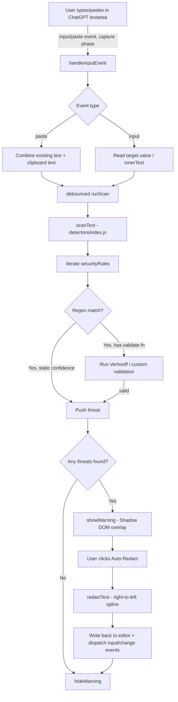
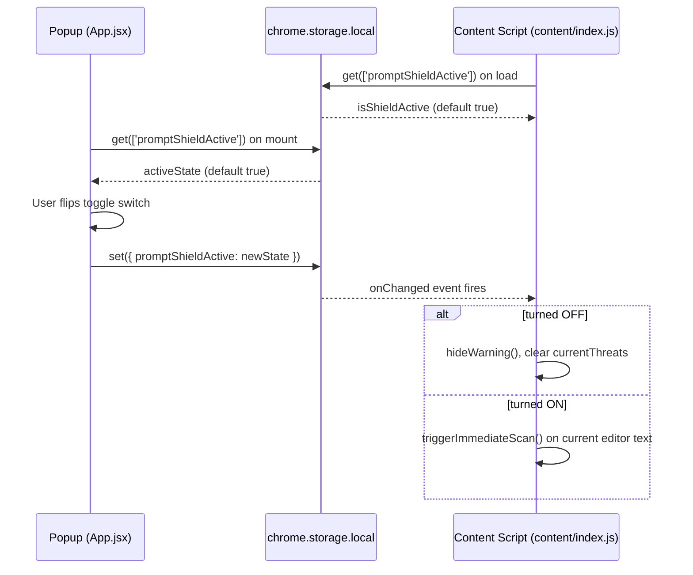
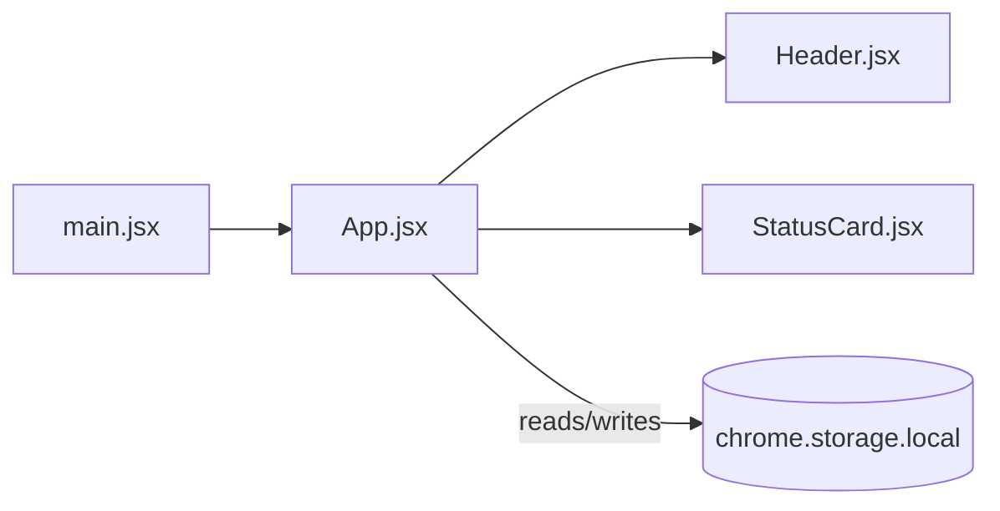

# 🛡️ PromptShield


**A local-first Chrome extension that scans your ChatGPT prompts for secrets and personal data — before you hit send.**

   

> ⚠️ **Status note:** This repository has no `LICENSE` file, no test suite, and no CI configuration at the time of writing. These sections are documented below as "not yet present" rather than assumed.

---

## Table of Contents

- [Overview](#overview)
- [Features](#features)
- [Tech Stack](#tech-stack)
- [Architecture](#architecture)
- [Folder Structure](#folder-structure)
- [File-by-File Reference](#file-by-file-reference)
- [Installation](#installation)
- [Configuration Files](#configuration-files)
- [How to Use](#how-to-use)
- [Example Workflow](#example-workflow)
- [Detection Rules](#detection-rules)
- [Error Handling](#error-handling)
- [Security & Privacy](#security--privacy)
- [Performance](#performance)
- [Limitations](#limitations)
- [Roadmap](#roadmap)
- [Testing](#testing)
- [Troubleshooting](#troubleshooting)
- [FAQ](#faq)
- [Contributing](#contributing)
- [License](#license)

---

## Overview

**PromptShield** is a Manifest V3 Chrome extension that watches the text you type into **chatgpt.com** and warns you in real time if it contains sensitive data — API keys, email addresses, Indian PAN card numbers, or Aadhaar-style government ID numbers — before that text is ever sent to a third-party AI model.

**Why it exists:** People routinely paste logs, config snippets, support tickets, or personal documents into chat-based AI tools without realizing they've included live credentials or personally identifiable information (PII). Once sent, that data has left the user's control. PromptShield acts as a last line of defense at the point of typing/pasting.

**Problem it solves:** Accidental data leakage into LLM chat interfaces — a growing concern for individual users and organizations that use ChatGPT for day-to-day work.

**Who should use it:** Developers, IT/security-conscious individuals, and anyone who pastes real-world text (code, forms, emails) into ChatGPT and wants a lightweight, local safety net.

**Real-world use case:** A developer debugging an issue pastes a `.env` file into ChatGPT to ask for help. PromptShield detects the OpenAI API key in the pasted text, flags it instantly, and offers a one-click redaction before the message is submitted.

All detection and redaction happens **entirely inside the browser tab** — no prompt text is ever sent to an external server by the extension itself.

---

## Features

### 1. Real-time sensitive-data scanning
Every keystroke and paste event inside a ChatGPT prompt box is scanned (with a 200ms debounce) against a set of regex/algorithmic detection rules.
- **How it works:** `document.addEventListener('input'/'paste', ...)` in `src/content/index.js` captures the current text of the focused editor and calls `scanText()`.
- **Files:** `src/content/index.js`, `src/detectors/index.js`

### 2. Multi-pattern threat detection
Detects four categories of sensitive data out of the box:
- OpenAI-style API keys (`sk-`, `sk-proj-`, `sk-svcacct-`, `sk-admin-`, `sk-none-`, `sk-org-`)
- Email addresses
- Indian PAN card numbers
- 12-digit Indian government ID numbers (Aadhaar-format), validated with the **Verhoeff checksum algorithm** to eliminate false positives from generic 12-digit numbers (tracking numbers, invoice numbers, etc.)
- **How it works:** Each rule in `securityRules` (in `src/detectors/rules.js`) pairs a regex with either a static confidence level or a `validate()` function.
- **Files:** `src/detectors/rules.js`, `src/detectors/verhoeff.js`, `src/detectors/index.js`

### 3. Instant paste detection
Pasted text is scanned by combining the existing editor content with the clipboard payload *before* the paste is committed to the DOM, so nothing slips through on paste.
- **Files:** `src/content/index.js` (`handleInputEvent`)

### 4. Shadow DOM warning overlay
When a threat is found, a floating warning panel appears in the top-right of the page, listing each detected threat and its confidence level, isolated from the host page's styles via Shadow DOM (so ChatGPT's CSS can't break it, and vice versa).
- **Files:** `src/content/ui.js`

### 5. One-click auto-redaction
Clicking "🛡️ Auto-Redact Threats" replaces every detected threat in the live editor with a `[REDACTED_<TYPE>]` placeholder, splicing the text from right to left so earlier character offsets stay valid, and preserves the cursor position in `<textarea>` fields.
- **Files:** `src/detectors/redact.js`, `src/content/index.js` (`executeSafeRedaction`)

### 6. Global on/off toggle synced via `chrome.storage`
The React popup exposes a switch that flips `promptShieldActive` in `chrome.storage.local`. The content script listens for `chrome.storage.onChanged` and reacts instantly — including re-scanning whatever text is already in the box the moment protection is turned back on.
- **Files:** `src/App.jsx`, `src/content/index.js`

### 7. SPA-aware re-injection
ChatGPT is a single-page app that swaps DOM content without full page reloads. A `MutationObserver` watches `document.body` and re-injects the warning UI host if it ever gets removed.
- **Files:** `src/content/index.js`

### 8. Popup dashboard UI
A small React popup (340×500px) shows shield status ("System Armed" / "System Disabled") and a two-box stat grid (Status, Environment).
- **Files:** `src/App.jsx`, `src/components/Header.jsx`, `src/components/StatusCard.jsx`, `src/App.css`

---

## Tech Stack

| Technology | Purpose | Why it was chosen | Possible alternatives |
|---|---|---|---|
| **React 19** | Popup UI rendering | Component model + hooks (`useState`, `useEffect`) simplify toggling and status display | Vue, Svelte, vanilla JS |
| **Vite 8** | Build tool / dev server | Fast HMR, native multi-entry bundling (popup + content script) via Rollup config | Webpack, Parcel |
| **@vitejs/plugin-react** | JSX/Fast Refresh support in Vite | Official React integration for Vite | `@vitejs/plugin-react-swc` |
| **ESLint 10** (flat config) | Linting | Catches bugs and enforces React Hooks rules | Biome, Rome |
| **eslint-plugin-react-hooks** | Hooks-specific lint rules | Prevents stale closures / dependency bugs | — |
| **eslint-plugin-react-refresh** | Ensures HMR-safe component exports | Vite-specific correctness | — |
| **Chrome Extension Manifest V3** | Extension platform | Required by current Chrome Web Store policy | Manifest V2 (deprecated) |
| **`chrome.storage.local` API** | Persisting the active/inactive toggle across popup and content script | Simple, extension-scoped, syncless local persistence | `localStorage` (not shared across contexts), `chrome.storage.sync` |
| **Shadow DOM (native browser API)** | Isolating the injected warning UI from host page CSS | Zero-dependency style isolation, no iframe overhead | iframe injection, CSS-in-JS with high specificity |
| **Vanilla JS content script** (`src/content/`) | Runs inside `chatgpt.com` page context | Content scripts can't easily use React without a larger bundle; a lightweight DOM-based UI keeps footprint small | React-rendered content-script UI |
| **npm** | Package manager | Default with Node.js, lockfile present (`package-lock.json`) | pnpm, yarn |

There is **no backend, no database, no external API calls, and no authentication layer** in this project — it is a purely client-side, in-browser tool. There is no state-management library beyond React's built-in `useState`.

---

## Architecture

PromptShield ships as **two independently bundled entry points** from a single Vite config (`vite.config.js`):

1. **Popup UI** — a standard React app (`index.html` → `src/main.jsx` → `src/App.jsx`) rendered when the user clicks the extension icon.
2. **Content script** — `src/content/index.js`, bundled to a single `content.js` file and injected into `https://chatgpt.com/*` per `public/manifest.json`.

These two bundles do **not** share a JS runtime — they communicate indirectly through `chrome.storage.local`, which both can read/write and subscribe to via `chrome.storage.onChanged`.

### High-level data flow



### Extension lifecycle & storage sync



### Component interaction (Popup)



---

## Folder Structure

```
PromptShield/
│
├── index.html                # Popup entry HTML (Vite root document)
├── vite.config.js            # Dual-entry build config (popup + content script)
├── eslint.config.js          # Flat ESLint config for JS/JSX
├── package.json              # Dependencies & npm scripts
├── package-lock.json         # Locked dependency graph
│
├── public/                   # Static assets copied as-is into the build output
│   ├── manifest.json         # Chrome Extension Manifest V3 definition
│   ├── favicon.svg           # Popup favicon
│   └── icons.svg             # Icon sprite/asset
│
└── src/
    ├── main.jsx               # React root bootstrap for the popup
    ├── App.jsx                # Root popup component; owns active/inactive state
    ├── App.css                # All popup styling (design tokens + layout)
    ├── index.css               # Global stylesheet entry (currently empty)
    │
    ├── assets/                # Static images used by the popup (hero.png, react.svg, vite.svg)
    │
    ├── components/            # Presentational React components for the popup
    │   ├── Header.jsx          # Brand header + protection toggle switch
    │   └── StatusCard.jsx      # "System Armed / Disabled" hero card
    │
    ├── content/                # Code that runs inside the ChatGPT web page (content script)
    │   ├── index.js             # Event wiring, debounced scanning, redaction, SPA observer
    │   └── ui.js                 # Shadow DOM warning overlay (vanilla DOM, no React)
    │
    └── detectors/              # Pure, framework-agnostic detection & redaction logic
        ├── index.js              # scanText() — runs all rules against a string
        ├── rules.js               # Declarative list of detection rules (regex + validators)
        ├── verhoeff.js             # Verhoeff checksum implementation for ID validation
        └── redact.js               # redactText() — coordinate-safe placeholder substitution
```

**How the folders interact:**
- `src/detectors/` is pure logic with **no DOM or Chrome API dependency** — it is imported by `src/content/index.js` but could be unit-tested or reused in isolation.
- `src/content/` depends on `src/detectors/` for scanning/redaction and owns all direct DOM manipulation and Chrome extension API calls (`chrome.storage`).
- `src/components/` and `src/App.jsx` form the popup UI tree and only talk to the outside world through `chrome.storage.local` — they never call into `src/detectors/` or `src/content/` directly.
- `public/manifest.json` is the contract that tells Chrome which built files (`index.html`, `content.js`) to load and where.

---

## File-by-File Reference

### `src/main.jsx`
- **Purpose:** Bootstraps the React application for the popup.
- **Responsibilities:** Mounts `<App />` into `#root` inside `React.StrictMode`.
- **Exports:** none (entry file).
- **Imports:** `react`, `react-dom/client`, `./index.css`, `./App.jsx`.
- **Executed when:** The popup HTML (`index.html`) loads, i.e., when the user opens the extension popup.

### `src/App.jsx`
- **Purpose:** Root component of the popup; single source of truth for the shield's on/off state as seen by the UI.
- **State:** `isActive` (boolean, default `true`), `isInitializing` (boolean, default `true`).
- **Responsibilities:**
  - On mount, reads `promptShieldActive` from `chrome.storage.local` (falls back to `true` if unset, and to a non-extension "always initializing-false" path if `chrome.storage` is unavailable, e.g. when previewed outside the extension).
  - `handleToggle(e)` updates local state and persists the new value to `chrome.storage.local`.
  - Renders `Header` and `StatusCard`, plus an inline stats grid showing Status and a static "Local V3" Environment label.
- **Exports:** default `App` component.
- **Imports:** `Header`, `StatusCard`, `./App.css`, React hooks.
- **Used by:** `src/main.jsx`.

### `src/components/Header.jsx`
- **Purpose:** Presentational header bar for the popup.
- **Props:** `isActive` (boolean), `onToggle` (function).
- **Responsibilities:** Renders the brand icon/title/"MVP" badge and a styled checkbox toggle bound to `isActive`/`onToggle`.
- **Exports:** default `Header`.
- **Used by:** `App.jsx`.

### `src/components/StatusCard.jsx`
- **Purpose:** Presentational hero card summarizing shield status.
- **Props:** `isActive` (boolean).
- **Responsibilities:** Swaps between a check-circle icon/"System Armed" copy and an x-circle icon/"System Disabled" copy based on `isActive`.
- **Exports:** default `StatusCard`.
- **Used by:** `App.jsx`.

### `src/content/index.js`
- **Purpose:** The content script's entry point; orchestrates scanning, warning display, and redaction on `chatgpt.com`.
- **Module-level state:** `isShieldActive`, `activeTarget` (last focused editor element), `currentThreats` (last scan results).
- **Key functions:**
  - `triggerImmediateScan()` — locates the active editor (last known target, focused element, or first matching selector) and scans its current text synchronously, bypassing the debounce.
  - `debounce(func, wait)` — generic debounce helper.
  - `runScan` — debounced (200ms) wrapper around `scanText` + `showWarning`/`hideWarning`.
  - `handleInputEvent(event)` — universal handler for both `input` and `paste` events; for paste events it merges clipboard data with existing text before scanning.
  - `executeSafeRedaction()` — reads the current editor content, calls `redactText`, and writes the cleaned text back into either a `<textarea>` (preserving cursor position) or a `contenteditable` element (via `document.execCommand('insertText', ...)` with an `innerText` fallback), then dispatches synthetic `input`/`change` events so the host page (ChatGPT's React app) notices the change.
- **Side effects on load:** Calls `initUI()`, subscribes to `chrome.storage` (get + `onChanged`), attaches `input`/`paste` listeners on `document` with `{ capture: true }`, and starts a `MutationObserver` on `document.body` to re-inject the UI host if removed (SPA navigation resilience).
- **Imports:** `scanText` (detectors/index), `redactText` (detectors/redact), `initUI`/`showWarning`/`hideWarning` (content/ui).
- **Executed when:** Injected by Chrome into any page matching `*://chatgpt.com/*`, per `public/manifest.json`.

### `src/content/ui.js`
- **Purpose:** Builds and controls the floating warning overlay, entirely with vanilla DOM APIs and a Shadow DOM for style isolation.
- **Module-level state:** `shadowRoot`, `warningContainer`.
- **Key functions:**
  - `initUI()` — idempotently creates a fixed-position host `<div id="promptshield-shadow-host">`, attaches an open Shadow DOM, injects a `<style>` block, and creates the (initially hidden) `.shield-box` container.
  - `hideWarning()` — sets `display: none` on the warning container.
  - `showWarning(threats, onRedact)` — clears and rebuilds the warning panel's DOM (header, subtext with threat count, a scrollable threat list with name + confidence, and a redact button wired to the `onRedact` callback), then shows it.
- **Exports:** `initUI`, `hideWarning`, `showWarning`.
- **Used by:** `src/content/index.js`.
- **Notable design choice:** All content is built with `createElement`/`textContent` rather than `innerHTML`, avoiding any risk of injecting HTML from untrusted page/user content.

### `src/detectors/index.js`
- **Purpose:** The scanning engine — pure function, no side effects, no DOM/Chrome dependency.
- **Exports:** `scanText(text)`.
- **Logic:** Returns `[]` for non-string/empty input. Otherwise, iterates every rule in `securityRules`, runs `text.matchAll(rule.regex)` (chosen specifically for statelessness, avoiding `lastIndex` mutation bugs that a shared global regex with `.exec()` in a loop could introduce), and for each match either applies `rule.validate(value)` (if defined) or uses the rule's static `confidence`. Matches that pass validation are pushed as threat objects: `{ id, name, type, value, startIndex, endIndex, confidence }`.
- **Used by:** `src/content/index.js`.

### `src/detectors/rules.js`
- **Purpose:** Declarative registry of all detection rules.
- **Exports:** `securityRules` (array).
- **Current rules:**

  | Rule name | Type | Detection method |
  |---|---|---|
  | OpenAI API Key | Credential | Regex matching `sk-` and known prefixed variants (`sk-proj-`, `sk-svcacct-`, `sk-admin-`, `sk-none-`, `sk-org-`) plus legacy 32–48 char keys |
  | Email Address | PII | Standard email regex |
  | Indian PAN Card | PII | Regex for the 10-character PAN format (`AAAAA9999A`) |
  | Government Identity Number | PII | Regex candidate-matches 12-digit formatted numbers, then `validate()` calls `isValidVerhoeff` to confirm it's a real Aadhaar-format checksum before flagging |

- **Used by:** `src/detectors/index.js`.

### `src/detectors/verhoeff.js`
- **Purpose:** Implements the Verhoeff checksum algorithm to validate 12-digit government ID candidates and reject random 12-digit numbers (invoice IDs, tracking numbers, etc.) that would otherwise be false positives.
- **Exports:** `isValidVerhoeff(str)`.
- **Logic:** Strips spaces/hyphens, requires exactly 12 digits, reverses the digit array, and runs the standard Verhoeff `d`/`p` multiplication-table walk, returning `true` only if the final checksum digit is `0`.
- **Used by:** `src/detectors/rules.js`.

### `src/detectors/redact.js`
- **Purpose:** Produces a redacted copy of a string given a list of threat coordinates.
- **Exports:** `redactText(originalText, detectedThreats)`.
- **Logic:** Sorts threats by `startIndex` descending and splices replacements **right to left**, so replacing one match never shifts the character offsets of matches still pending — an important correctness detail since all offsets were computed against the *original* string. Each match is replaced with a `[REDACTED_<TYPE>]` placeholder (e.g. `[REDACTED_CREDENTIAL]`, `[REDACTED_PII]`).
- **Used by:** `src/content/index.js` (`executeSafeRedaction`).

### `public/manifest.json`
- **Purpose:** Chrome Extension Manifest V3 descriptor.
- **Key fields:** `permissions: ["activeTab", "storage"]`; `action.default_popup: "index.html"`; a single content script matching `*://chatgpt.com/*` and loading the built `content.js`.
- **Note:** The manifest references `content.js` and `index.html` as if they already exist at the extension root — these are produced by `npm run build` (see [Installation](#installation)). This manifest is not itself processed by Vite; it must be present alongside the build output when loading the unpacked extension.

### `vite.config.js`
- **Purpose:** Configures Vite/Rollup to produce **two** build outputs from one project: the popup (`index.html`) and the content script (`src/content/index.js`), the latter forced to output as a single, hash-free `content.js` so `manifest.json` can reference it by a stable name.

### `eslint.config.js`
- **Purpose:** Flat-config ESLint setup applying `@eslint/js` recommended rules, `eslint-plugin-react-hooks` recommended rules, and `eslint-plugin-react-refresh`'s Vite preset to all `.js`/`.jsx` files, with browser globals enabled and `dist/` ignored.

### `package.json`
- **Purpose:** Declares the project as a private, ESM (`"type": "module"`) package with four scripts (`dev`, `build`, `lint`, `preview`) and its React/Vite/ESLint dependency set.

---

## Installation

### Prerequisites
- **Node.js** — a reasonably current LTS version is expected (no `.nvmrc` or `engines` field is present in `package.json`, so no specific minimum is enforced by the repo itself; Vite 8 and React 19 require a modern Node runtime).
- **npm** (a `package-lock.json` is committed, so npm is the expected package manager; yarn/pnpm are not configured but would likely work).
- **Google Chrome** (or another Chromium-based browser) to load the unpacked extension.

### Clone & Install

```bash
git clone https://github.com/harsh-singh45/PromptShield.git
cd PromptShield
npm install
```

### Environment Variables

None. This project defines **no `.env` file, no `import.meta.env` usage, and no environment-variable-driven configuration** anywhere in the source.

### Development (Popup UI preview only)

```bash
npm run dev
```
This starts the Vite dev server for the **popup UI only** (`index.html`). Note that `chrome.*` APIs are unavailable outside the extension context, so `App.jsx`'s `useEffect` will fall through to its `else` branch (`isInitializing` becomes `false` with the default `isActive = true`) when previewed this way. The content-script behavior (scanning on chatgpt.com) **cannot** be previewed with `npm run dev` — it requires loading the built extension in Chrome.

### Production Build

```bash
npm run build
```
Outputs to `dist/`: the popup bundle (`index.html` + hashed assets) and the content script as `content.js` (unhashed, per `vite.config.js`). Vite copies everything in `public/` (including `manifest.json`, `favicon.svg`, `icons.svg`) into `dist/` as well.

### Loading the Unpacked Extension in Chrome

1. Run `npm run build`.
2. Open `chrome://extensions`.
3. Enable **Developer mode** (top right).
4. Click **Load unpacked** and select the generated `dist/` folder.
5. Visit `https://chatgpt.com` and start typing/pasting into a prompt box.

### Linting

```bash
npm run lint
```

### Preview the built popup

```bash
npm run preview
```

---

## Configuration Files

| File | Purpose |
|---|---|
| `package.json` | Dependency manifest and npm script definitions (`dev`, `build`, `lint`, `preview`). |
| `vite.config.js` | Configures the dual-entry (popup + content script) Rollup build and fixes `content.js`'s output filename. |
| `eslint.config.js` | Flat ESLint config: JS recommended rules + React Hooks + React Refresh (Vite) presets, browser globals. |
| `public/manifest.json` | Chrome Extension Manifest V3 — permissions, popup entry, and content script matching rules. |
| `.gitignore` | Excludes `node_modules`, `dist`, `dist-ssr`, logs, and editor directories from version control. |

No `tsconfig.json`, `tailwind.config`, `webpack.config`, `Dockerfile`, or GitHub Actions workflow files are present in this repository.

---

## How to Use

1. **Install** the extension as described above (build + load unpacked).
2. Click the **PromptShield icon** in the Chrome toolbar to open the popup. Confirm the toggle is **on** (green) — "System Armed."
3. Navigate to `https://chatgpt.com` and click into the prompt textbox.
4. **Type or paste** any text. If it contains an OpenAI-style API key, an email address, a PAN number, or a Verhoeff-valid 12-digit ID, a red-bordered warning card appears in the top-right corner of the page within ~200ms, listing each detected item and its confidence.
5. Click **"🛡️ Auto-Redact Threats"** to instantly replace all detected values in the textbox with `[REDACTED_<TYPE>]` placeholders. The warning card disappears and your cursor position is preserved.
6. To temporarily disable protection, reopen the popup and flip the toggle off — the warning card is dismissed immediately, and no further scanning occurs until it's switched back on (at which point PromptShield immediately re-scans whatever is currently in the box).

---

## Example Workflow

> User pastes a snippet like `Here is my key sk-proj-abc123... and contact me at jane@example.com` into ChatGPT.

1. `paste` event fires on the `contenteditable` prompt box → captured by `handleInputEvent` (capture-phase listener on `document`).
2. Existing text + clipboard text are concatenated and passed to the debounced `runScan`.
3. `scanText()` runs both the OpenAI API Key and Email Address regexes against the combined string, producing two threat objects.
4. `showWarning()` renders a Shadow DOM panel: "⚠ Sensitive Data Detected — Found 2 potential security risk(s) in prompt," listing "OpenAI API Key [HIGH]" and "Email Address [HIGH]."
5. User clicks **Auto-Redact** → `executeSafeRedaction()` calls `redactText()`, which splices in `[REDACTED_CREDENTIAL]` and `[REDACTED_PII]` from right to left, then writes the result back into the editor and fires synthetic `input`/`change` events so ChatGPT's own React state updates to match.
6. Warning panel hides; the textbox now shows the redacted text.

---

## Detection Rules

*(Duplicated here for quick reference — see `src/detectors/rules.js` for source of truth.)*

| Detector | Category | Confidence | Notes |
|---|---|---|---|
| OpenAI API Key | Credential | HIGH (static) | Covers modern (`sk-proj-`, `sk-svcacct-`, `sk-admin-`, `sk-none-`, `sk-org-`) and legacy `sk-` key formats |
| Email Address | PII | HIGH (static) | Standard RFC-like email pattern |
| Indian PAN Card | PII | HIGH (static) | 5 letters + 4 digits + 1 letter |
| Government Identity Number (Aadhaar-format) | PII | HIGH only if Verhoeff-valid | Regex first narrows to 12-digit formatted candidates; `isValidVerhoeff()` then confirms a real checksum to avoid flagging arbitrary 12-digit numbers |

There is currently no configuration surface (UI or otherwise) for users to add, disable, or tune individual rules — the rule set is fixed in source.

---

## Error Handling

The codebase relies on small, defensive guards rather than a formal error-handling framework:
- `scanText()` returns `[]` immediately for `null`/`undefined`/non-string input.
- `redactText()` returns the original text unchanged if no threats are passed in.
- `executeSafeRedaction()` bails out early if there's no `activeTarget`, no `currentThreats`, or the shield is inactive, and does nothing further if redaction produced no change (`originalText === cleanedText`).
- `initUI()` is idempotent (`if (shadowRoot) return;`) to avoid double-injecting the overlay.
- All `chrome.storage`/`chrome.*` access is guarded by `typeof chrome !== 'undefined' && chrome.storage` checks, so the code degrades gracefully (or is skipped) outside a real extension context.
- The `contenteditable` redaction path falls back to a direct `innerText` assignment if `document.execCommand('insertText', ...)` fails or is unsupported.

There is no logging framework, no retry/backoff logic, and no user-facing error messaging beyond `console.log` statements used for extension lifecycle debugging.

---

## Security & Privacy

- **No network calls:** Nothing in `src/` performs a `fetch`, `XMLHttpRequest`, or WebSocket call. All scanning and redaction happen synchronously in-browser.
- **No remote storage:** The only persistence used is `chrome.storage.local`, scoped to the extension and the user's own browser profile.
- **Minimal permissions:** `public/manifest.json` requests only `activeTab` and `storage` — no `<all_urls>` host permission, no `scripting`, no `cookies`, no `tabs`.
- **Narrow content-script scope:** The content script only runs on `*://chatgpt.com/*`, per the `content_scripts.matches` entry in the manifest.
- **XSS-safe overlay rendering:** `src/content/ui.js` builds all injected UI using `createElement`/`textContent`, never `innerHTML`, so detected threat values (which come from arbitrary user/page text) can't be interpreted as HTML/script.
- **Style isolation:** The warning overlay lives inside a Shadow DOM, preventing the host page's CSS from leaking in (and the overlay's CSS from leaking out).
- **Detected secrets are never transmitted anywhere** — they're only ever held in in-memory JS variables (`currentThreats`) for the duration needed to render the warning and perform redaction.

**Not implemented (by design, as this is a client-side MVP):** authentication, authorization, encryption at rest, or any secrets-scanning beyond the four rule types listed above.

---

## Performance

- **Debounced scanning:** Input events are debounced to 200ms (`src/content/index.js`) so the regex engine doesn't run on every single keystroke.
- **Stateless regex execution:** `scanText()` uses `String.prototype.matchAll`, which is explicitly chosen (per an inline code comment) to avoid `lastIndex`-related bugs and repeated-match issues that a shared global `RegExp` with `.exec()` in a loop can introduce.
- **Right-to-left splicing:** `redactText()`'s single right-to-left pass avoids recomputing offsets after each replacement (`O(N log N)` sort + `O(N)` reconstruction, per its own doc comment).
- **Instant rescan on re-activation:** rather than waiting for the next keystroke, `triggerImmediateScan()` gives immediate feedback the moment protection is turned back on, at the cost of one synchronous scan.
- No code-splitting/lazy-loading is configured beyond Vite's default popup/content-script separation; the extension's overall footprint is small (no external runtime dependencies beyond React/ReactDOM for the popup).

---

## Limitations

- **Single-site support:** The content script only activates on `chatgpt.com`; no other AI chat platforms (Claude.ai, Gemini, etc.) are currently supported.
- **Fixed, non-configurable rule set:** Users cannot add custom regexes, disable individual detectors, or adjust confidence thresholds from the UI.
- **Region/format-specific PII rules:** PAN and Aadhaar-format detectors are India-specific; there is no equivalent for SSNs, credit card numbers, phone numbers, passport numbers, or other countries' ID formats.
- **No persistent history/log:** Despite CSS classes for a `.log-section`/`.log-list` existing in `App.css`, there is no corresponding React component or logic that populates an activity log in the current codebase — the popup only shows current status.
- **No automated tests, CI pipeline, or LICENSE file** exist in the repository at this time.
- **Regex-based detection** can produce false positives/negatives inherent to pattern matching (e.g., any string matching the email pattern is flagged regardless of context).

---

## Roadmap

> The repository does not contain an explicit roadmap document; the following is a reasonable extrapolation from the current MVP state and existing (unused) CSS scaffolding, not a commitment from the project's maintainers.

- **Immediate:** Add a `LICENSE` file; wire up the existing `.log-section`/`.log-list` CSS to a real activity-log component and state.
- **Short-term:** Support additional chat platforms (e.g., Claude.ai, Gemini) by extending `content_scripts.matches`; add more PII detectors (phone numbers, credit cards, generic API key formats for other providers like AWS/GitHub tokens).
- **Medium-term:** User-configurable rule toggles and custom regex rules via the popup UI; per-site enable/disable.
- **Long-term:** Automated test suite (unit tests for `src/detectors/`, integration tests for the content script); CI pipeline (lint + test on PR); Chrome Web Store packaging/release automation.

---

## Testing

There is currently **no test suite** in this repository — no test runner is listed in `package.json`'s `devDependencies`, and no `*.test.js`/`*.spec.js` files exist. `src/detectors/` (scanning, validation, redaction) is written as pure functions with no DOM/Chrome dependency, making it a natural candidate for unit tests (e.g., with Vitest) should a suite be added.

**Manual testing today** consists of building the extension, loading it unpacked in Chrome, and exercising it live on `chatgpt.com`.

---

## Troubleshooting

| Issue | Likely Cause | Fix |
|---|---|---|
| Popup shows a blank screen | `chrome.storage` call hasn't resolved yet, or `isInitializing` never flips to `false` outside a real extension context | Ensure you're loading the extension via `chrome://extensions` → Load unpacked, not just opening `index.html` directly |
| No warning appears when pasting a known key/email | Extension is toggled off (check the popup switch); or the target element doesn't match `textarea, [contenteditable="true"], #prompt-textarea` | Re-enable via the popup; confirm ChatGPT's DOM structure hasn't changed its editor selector |
| Warning UI missing after navigating within ChatGPT | Should be self-healing via the `MutationObserver` in `content/index.js`, which re-calls `initUI()` if the host element is removed | Refresh the page if it persists |
| `manifest.json` errors when loading unpacked | Loaded the project root instead of `dist/`, or forgot to run `npm run build` first | Run `npm run build` and load the `dist/` folder |
| Redaction doesn't seem to "stick" in ChatGPT's UI | ChatGPT's own React state may need the synthetic `input`/`change` events to register the change | This is already handled in `executeSafeRedaction()`; if it still fails, ChatGPT's DOM structure may have changed |

---

## FAQ

**Does PromptShield send my prompts anywhere?**
No. All scanning happens locally in your browser tab; there are no network calls in the codebase.

**Which sites does it work on?**
Only `chatgpt.com`, per the `content_scripts.matches` rule in `public/manifest.json`.

**What counts as a "threat"?**
Currently: OpenAI-style API keys, email addresses, Indian PAN card numbers, and Verhoeff-valid 12-digit Indian government ID numbers.

**Can I add my own detection rules?**
Not via the UI today — you'd need to edit `src/detectors/rules.js` directly and rebuild.

**Does redaction edit the message ChatGPT actually receives, or just what's displayed?**
It edits the live DOM value of the prompt box itself (and dispatches `input`/`change` events), so whatever you send afterward reflects the redacted text.

**Why does the popup say "MVP"?**
It's a literal badge in `Header.jsx` (`<span className="version-badge">MVP</span>`) indicating the project's current maturity stage.

**Does turning the shield off delete anything I've already typed?**
No — it only stops scanning and hides any currently visible warning; it doesn't modify your text.

**What happens if I turn protection back on mid-conversation?**
`triggerImmediateScan()` immediately re-scans whatever text is currently in the focused/last-known editor, rather than waiting for the next keystroke.

**Is there an Aadhaar number "database" being checked against?**
No — `isValidVerhoeff()` is a pure checksum algorithm; it validates the mathematical structure of a 12-digit number, not whether it's a real, issued Aadhaar number.

**Does it work in Firefox or other browsers?**
The manifest is Manifest V3 targeting the `chrome.*` API surface; it hasn't been documented or tested for other browsers.

**Is there a settings/options page?**
No dedicated options page exists (`manifest.json` defines only `action.default_popup`, no `options_page`/`options_ui`).

**What license is this under?**
None specified — no `LICENSE` file is present in the repository. Treat usage/redistribution rights as undefined until the maintainer adds one.

---

## Contributing

No `CONTRIBUTING.md`, issue templates, or PR templates currently exist in this repository. In their absence, reasonable defaults:
- Follow the existing ESLint configuration (`npm run lint` before committing).
- Keep `src/detectors/` free of DOM/Chrome API dependencies so it stays independently testable.
- Match the existing code style (functional React components, named exports for utilities, JSDoc-style comments on non-trivial functions).
- Open a pull request against `main` describing the change and its motivation.

---

## License

**Not specified.** No `LICENSE` file is present in this repository as of the current commit (`6a73fb6`). Confirm licensing terms with the repository owner before reuse or redistribution.

---

## Credits

Maintained by [harsh-singh45](https://github.com/harsh-singh45).

## Contact

For issues or questions, use the repository's GitHub Issues page: https://github.com/harsh-singh45/PromptShield/issues